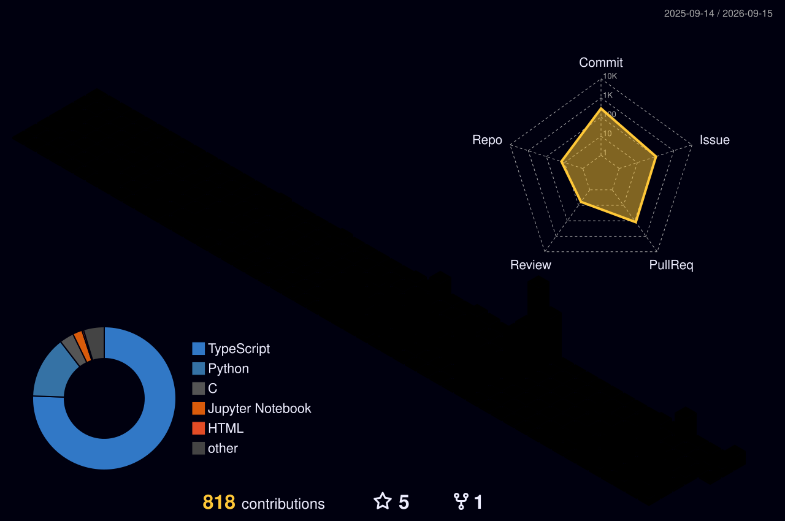

 

**Computer Engineering @ CCNY · 4+1 M.S. Track · GPA 3.8**

 

---

## About

I'm a Computer Engineering student at **The City College of New York** in the accelerated **4+1 M.S. track**, focused on building AI/ML systems that are not just trained — but evaluated, deployed, and usable.

My strongest interests:

- **Self-supervised & representation learning**
- **Computer vision & attention-aware systems**
- **NLP & language model fine-tuning**
- **ML productization** — inference, APIs, deployment, calibration

> **Currently:** Undergraduate researcher at the **CCNY Media Lab** (self-supervised learning for landslide susceptibility mapping) · ML intern at **Tactorum** (computer vision for behavioral research) · **CUNY Tech Prep** Data Science Fellow, Cohort 12

---

## 3D Contribution Graph

---

## Featured Projects

### SSL for Landslide Susceptibility Mapping — CCNY Media Lab
> `PyTorch` &nbsp;·&nbsp; `ResNet-18` &nbsp;·&nbsp; `Self-Supervised Pretraining` &nbsp;·&nbsp; `Geospatial ML`

Full geospatial deep learning pipeline advised by Prof. YingLi Tian, in collaboration with Penn State and Stony Brook researchers. Self-supervised pretraining (masked-autoencoder + contrastive objectives) raised AUC **0.860 → 0.905** and worst-region robustness **0.59 → 0.85**. Scaled to a 24 GB, 13-channel terrain corpus (50k pretraining patches, 18k labels), reaching **0.955 ± 0.001 AUC** across 4 seeds / 5-fold CV. Found and fixed spatial leakage in the lab's k-fold splits via group-safe CV. Ran 300+ multi-seed training runs on rented GPUs for under $10 with automated job resumption and monitoring.

### ResolveNYC: 311 Complaint Resolution Classifier | PyTorch, Hugging Face Transformers, scikit-learn
> [repo](https://github.com/mohamedhiba/ResolveNYC) &nbsp;·&nbsp; [demo](https://huggingface.co/spaces/Mohamedhiba/resolvenyc-demo) &nbsp;·&nbsp; ML lead, 4-person team

Multimodal DistilBERT + tabular MLP for 4-class resolution-time classification over 100k NYC 311 records. Inverse-frequency weighting, ordinal loss, and dual learning rates took the best of five models to **77.7% accuracy / 0.753 macro-F1**, beating logistic regression and XGBoost baselines. Shipped to Hugging Face Hub with sub-2s CPU inference.

### focusedAI: Real-Time Attention State Classifier
> [repo](https://github.com/mohamedhiba/focusedAI) &nbsp;·&nbsp; [demo](https://huggingface.co/spaces/Mohamedhiba/focusedAI-demo) &nbsp;·&nbsp; `MobileNetV3-Small` &nbsp;·&nbsp; `PyTorch` &nbsp;·&nbsp; `OpenCV`

Webcam-based 3-class attention classifier (`focused / neutral / distracted`). Hit **0.918 macro-F1** at **4–5ms p95** on-device inference (M3 Pro, MPS), stabilized via temperature scaling, per-class logit biases, and hysteresis. Ships with an interactive Gradio demo.

### lstm-keyboard-v2 — Next-Word Prediction
> [repo](https://github.com/mohamedhiba/lstm-keyboard-v2) &nbsp;·&nbsp; [live API](https://lstm-keyboard-demo-743198811832.us-central1.run.app/) &nbsp;·&nbsp; `PyTorch LSTM` &nbsp;·&nbsp; `FastAPI` &nbsp;·&nbsp; `Docker` &nbsp;·&nbsp; `Cloud Run`

Word-level LSTM trained from scratch on WikiText-2, packaged as a portable model bundle and served via FastAPI on Cloud Run, with automated Docker container builds.

### FP8 Adder & Parallel Kernels | MIPS Assembly, VHDL, C

Parallel MIPS and VHDL kernels for an FP8 adder, dot product, and matrix-multiply benchmarks, with synchronization primitives and virtual-memory management implemented at the OS level.

**More public work:** [tabular-ml-playbook](https://github.com/mohamedhiba/tabular-ml-playbook) · [fastcard](https://github.com/mohamedhiba/fastcard) · [discord-pomodoro-bot](https://github.com/mohamedhiba/discord-pomodoro-bot) · [provisional](https://github.com/mohamedhiba/provisional) ([live](https://provisional-beta.vercel.app/))

---

## Tech Stack

**Languages**

**ML / AI**

**Backend & Infra**

---

## GitHub Activity

  

 

---

## Experience

**Undergraduate Researcher — CCNY Media Lab (Prof. YingLi Tian)** · April 2026 – Present
Self-supervised learning for landslide susceptibility mapping; sole owner of the deep-learning codebase.

**Machine Learning Intern — Tactorum (Remote, via CCNY CiPASS)** · July 2026 – Present
Computer-vision pipeline for automated rodent behavioral analysis in pain-research assays.

**Data Science Fellow, Cohort 12 — CUNY Tech Prep** · May 2026 – Present
Year-long, industry-taught data science program; end-to-end ML projects presented at Demo Night.

**Computer Science Intern — Globetrotting Dominicana LLC** · May 2025 – July 2025
Admin dashboard, REST integrations, Docker containerization, GitHub Actions CI/CD.

**Undergraduate Teaching Assistant — Hunter College (CSCI 127/135)** · August 2023 – May 2026
Top-performing TA, two consecutive semesters. 100+ 1-on-1 sessions in Python & C++.

---

*Open to ML engineering internships, AI research, and software roles with strong AI/ML exposure*

&nbsp;

